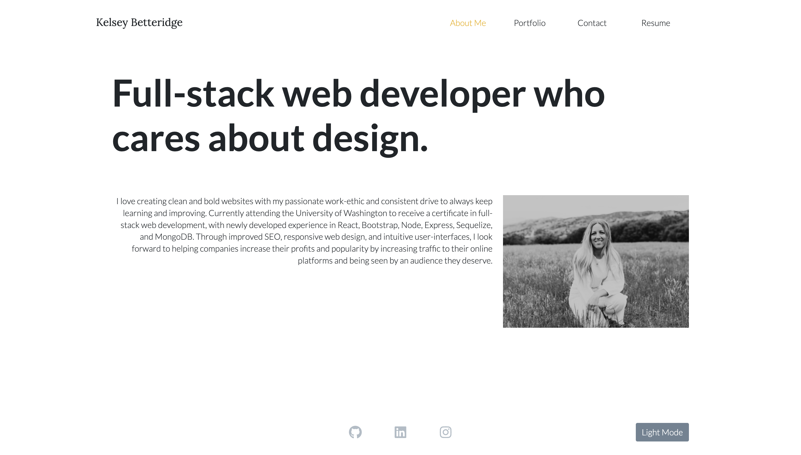

# React Portfolio

## Introduction

This is the second version of my portfolio which I built using ReactJS. It features six of my most recent projects in web development. Navigate [here](https://kelseybrianne.github.io/react-portfolio/) to explore the site with its light and dark mode and the ability to switch between four different page views.

## Technologies Used

- HTML
- CSS
- Bootstrap
- ReactJS

## License

